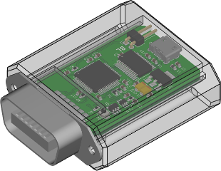

# Hayashi-light-remote

An Open-Source and Open-Hardware USB dongle for controlling Hayashi light source
LA-150CE remotely. It should also be compatible with LA-150UE, LA-100IR and
LA-150FBU, but this has not been tested (any feedback is welcome).

The halogen lamp can be turned on and off, and its intensity can be adjusted
from the software.



# Python API

Once the dongle is connected to the lamp and the computer, the provided Python3
library can be used to communicate with the dongle and take control of the lamp:

```python
import hyshlr

device = hyshlr.HyshLR()
device.lamp = True
device.power = 0.5
```

# External documentation

[Manufacturer documentation with remote connector interface specification](http://www.korin-hayashi.com.cn/uploadfile/2018/1030/20181030095820716.pdf)

## Licensing

This project is licensed under the GNU Lesser General Public Licence version 3
(LGPLv3). See COPYING and COPYING.LESSER for license details.
